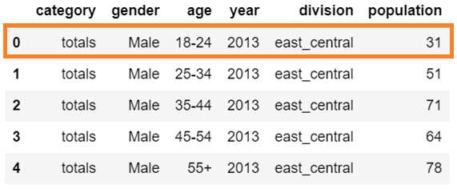
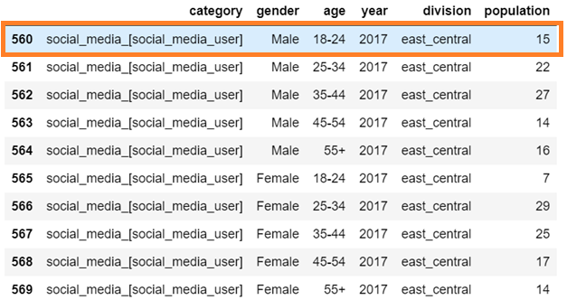
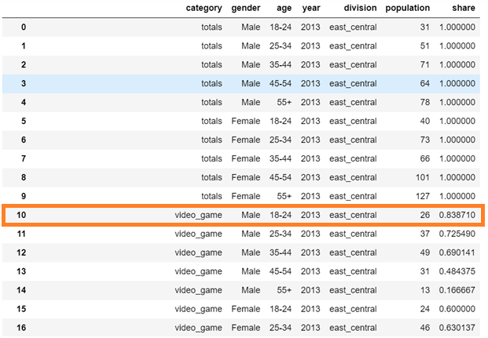
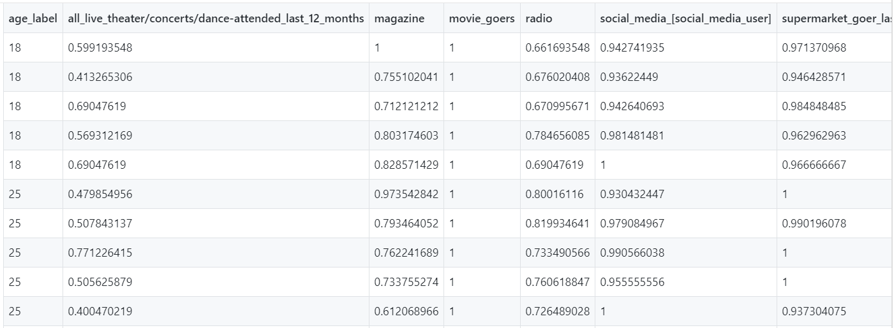
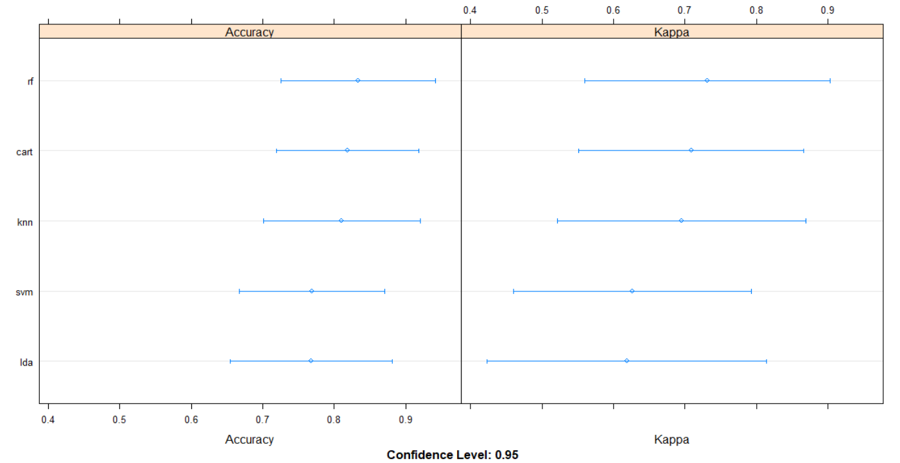
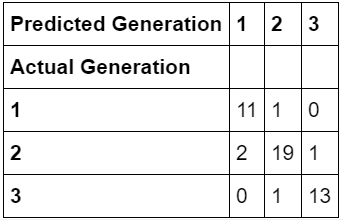

# Machine Learning Step by Step

## Step 1   

Category “Totals” refers to the sample group of our project which is the total population 
of _**DVD movie purchasers**_  with given division (region), year, age and gender. Population under 
all other categories refer to the “Cross Region” with our study group. For example: 

  

## Step 2   
We generate another column named “share” which is the proportion in _**DVD purchaser**_ people who also 
choose given category **(e.g. share = 15/31 = 0.484)**, and there are 48.4% people from the sample group 
who also choose social media, who are male at age 18-24 from east central region . So, there are 
absolutely some people who will choose more than one category. 

  

## Step 3  

We generate a share table with average share of each category between two genders each division and year. 
(using Pivot Table in Excel)

## Step 4  

We replace each text age label with index, where **age 18-35 was defined as class 1, age 35-55 was 
defined as class 2, and 55+ was defined as class 3**. And we used Excel to rescale all share decimal 
numbers to 5 levels, indexing 1 through 5. 

## Step 5  

We used **R** to do model comparison and feature selections. There are 5 candidate ML models, and 
Random Forest Classifier has the highest Accuracy and Kappa, so we choose to build RF Classification 
Model and make prediction in python. And according to the “Variable Importance Table”, we have tested 
several models with different feature selection. And we found the one with features [ 'tv','social_media',
'magazine','all_live','video_game','tablet_owner'] has the highest accuracy.

  

  

  

## Step 6  

We rebuilt a **Random Forest Classification Model** using **Python** since it is more front-end friendly. 
The following table were used as validation dataset, and we have calculated a probability array, 
where each one array inside represents a case in the validation dataset, and each of the three numbers 
in this array is the probability of the model predicted class. For instance, in first array, it shows 
[1., 0., 0.] which mean the model predicted that this case has 100% probability belongs to class 1, and 
zero probability belongs to other two classes. And then we generated a **confusion matrix**, and numbers on 
the diagonal means it was corrected predicted, and numbers on all other position means it was not correctly 
predicted. So the **accuracy rate = (11 + 19 + 13)/(11 + 2 + 1 + 19 + 1 + 1 + 13) = 89.6%**.

 

  

