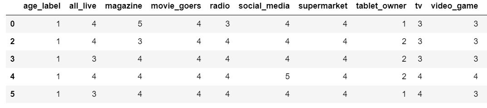
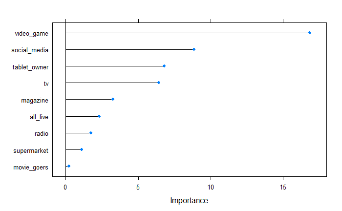
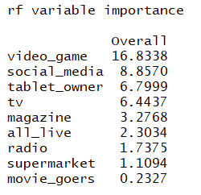
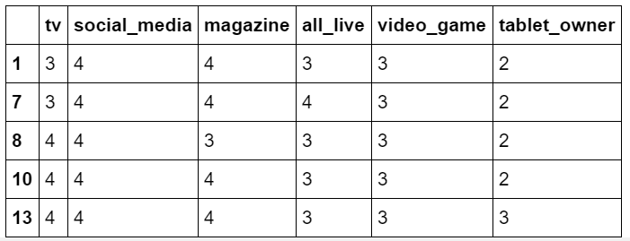
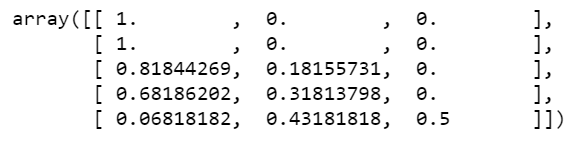

        

<h1 align="center">Media Behavior Trends Analytics</h1>

Predicting Consumer Behavior with Artificial Neural Networks

🎩

## Contributors

Welcome to *Media Behavior Trends Analytics*, we are team **Datakenstein** !

[David Gu](https://www.linkedin.com/in/david-gu-a0806b5a/) | [Yuanyuan (Yoyo) Wu](https://www.linkedin.com/in/yuanyuan-yoyo-wu-442474116/) | [Yingling Wang](https://www.linkedin.com/in/yin-ling-wang-b02274132/) | [Sean Yu](https://www.linkedin.com/in/sean-yu-733205a6/) | [Weijing Zhang](https://www.linkedin.com/in/weijing-zhang-100839149/) | [Xiangyu Zhang](https://www.linkedin.com/in/xiangyu-zhang-13046b155/)

We are a group of data enthusiast from various background including business, media marketing, statistics and engineering who aim to

* Use demographic, psychographic, attitudinal, and behavioral data to refine consumer targets and inform engagement strategies

* Brings consumer targets to life with vivid and complete profiles, including lifestyles, attitudes, brand preferences and media use

* Generate geographic nuances of consumers in all of America’s media markets, including purchase behavior, attitudes, lifestyles and much more.

* Develop a unique, media-neutral machine learning metric for detecting consumer trends in terms of planning, buying and selling

## Story

> DMA (Designated Market Area) regions are the geographic areas in the United States in which local television viewing is measured by The Nielsen Company. The DMA data are essential for any marketer, researcher, or organization seeking to utilize standardized geographic areas within their business in terms of:

|            Generation   Name           | Births Start | Births End | Age as of 2018 |
|:--------------------------------------:|:------------:|:----------:|:--------------:|
|        Baby   Boomer Generation        |     1946     |    1961    |     55 +       |
|            Generation   X              |     1960     |    1979    |     35 - 54    |
|            Millennials                 |     1980     |    1994    |     25 - 34    |
|                 Gen Z                  |     1995     |    2012    |     18 - 24  

Our Main Focus of this project is to compare Millennials& Gen Z and other generations' consumer behaviours.
Becuase Millennials and Gen Z grew up with smart phone and internet.  
Millenials are aging into a new lifestage as they start to get married settle down, and have families. 
Gen Z are aging from teenagers to young adults, they start graduating from college and getting the first job. 

[Tableau Visulization](https://public.tableau.com/profile/davidgu#!/vizhome/BehaviorAnalytics/Geography?publish=yes)

## Think before the demo day

- Why did you pick this problem?
- What was the datset like when you got it?
- What data cleaning did you have to do?

- Why did you your model?
- What did you find when the model
    predictive features
    Model tuning
    
- Why the choice of visualization/display

## Proposal

This study, based on a behavioral data set of media indstry from 2013 - 2016, suggests that about 85% of the customer loyalty in terms of actual behavior can be predicted, in particular by demographic factors such as their generation group  
In the modern society, everyone is trying to make more money for living, and time has literally become more valuable, but not everyone has time to go to the theatre and spend two hours to watch a movie, and people still need entertainment industry for relaxing and enjoying their lives. Therefore Home Entertainment is a more convenience and private way to attain the propose of entertaining.

> “Most adults say they enjoy entertaining people in their home—an attitude that has remained constant for more than a decade. In the last three years, a substantial 77% of adults have hosted a party in their home. Informal gatherings are far more prevalent than formal parties, with 44% participation compared to 17%. Lifestyle trends, technology and social media influences, demographic factors, and motivations to host parties support the prevalence of informal gatherings.”
>
> By *-Dana Macke, Associate Director, Lifestyles & Leisure*

As the largest film industry in the world, Americans love movies, and enjoy watching movies at home. Our purpose is to track movie purchasers’ behaviors in different generations and genders.

Top Retailers like Amazon, Walmart, Target and Best & Buy, they are using data analysis and ML to target audiences, and do dynamic advertising targeting to raise awareness and to increase sales of the products.

On social media and websites, there are many sponsored ads and banners ads, most of them are targeting consumers who have specific behaviors. 
We pulled data from Simmon consumer behavior database, and list eleven behavior categories for movie purchasers (purchase dvd/blu-ray dics in past 12 months) in different generations ( Millennial, Gen X, Gen Y, Gen Z):

(1) Video Games Players
(2) Streaming Video Watchers
(3) Digital Music Users
(4) Cable TV Watchers
(5) Radio Listeners
(6) Magazine Readers
(7) Movie Goers
(8) Supermarket Shoppers
(9) Tablet Owners
(10) Live events Goers
(11) Social Media Users

In the end of the project we made movie purchasers’ consumer behavior portfolio for each generations, and analyze each generations’ preference in each behavior categories.

## Machine Learning

#### Methodology: Random Forest Classifier

#### Step 1

Category “Totals” refers to the sample group of our project which is the total population of _**DVD movie purchasers**_  with given division (region), year, age and gender. Population under all other categories refer to the “Cross Region” with our study group. For example: 

---

#### Step 2

We generate another column named “share” which is the proportion in _**DVD purchaser**_ people who also 
choose given category **(e.g. share = 26/31 = 0.8387)**, and there are 83.5% people from the sample group 
who also choose social media, who are male at age 18-24 from east central region . So, there are 
absolutely some people who will choose more than one category. 

  

---

#### Step 3

We generate a share table with average share of each category between two genders each division and year. 
(using Pivot Table in Excel)

---

#### Step 4

We replace each text age label with index, where

(1) **age 18-35 was defined as class 1**
(2) **age 35-55 was defined as class 2**
(3) **age 55+ was defined as class 3**
 
 And we used Excel to rescale all share value into 5 levels from lowest to highest, indexing 1 through 5. 

---

#### Step 5

We used **R** to do model comparison and feature selections. There are 5 candidate ML models, and 
Random Forest Classifier has the highest Accuracy and Kappa, so we choose to build RF Classification 
Model and make prediction in python. And according to the “Variable Importance Table”, we have tested 
several models with different feature selection. And we found that [ 'tv','social_media',
'magazine','all_live','video_game','tablet_owner'] features has the highest accuracy.

  

  

---

#### Step 6

We rebuilt a **Random Forest Classification Model** using **Python** since it is more front-end friendly. 
The following table were used as validation dataset, and we have calculated a probability array, 
where each one array inside represents a case in the validation dataset, and each of the three numbers 
in this array is the probability of the model predicted class. For instance, in first array, it shows 
[1., 0., 0.] which mean the model predicted that this case has 100% probability belongs to class 1, and 
zero probability belongs to other two classes. And then we generated a **confusion matrix**, and numbers on the diagonal means it was corrected predicted, and numbers on all other position means it was not correctly predicted. So the **accuracy rate = (11 + 19 + 13)/(11 + 2 + 1 + 19 + 1 + 1 + 13) = 89.6%**.

 

  

## Findings

(1) South division is the winner in terms of population and most of the people are used to old school media such as Movies, Supermarket, TV, Magzine and Radio whereas younge generations are apprently stick to modernized media
        *South Division has more states include than others*

(2) Female takes the majority of the market share in all categories and Movies and Supermarkets are pretty much their backyards

(3) Comparing Gen Z and Baby Boomers, Gen Z is the minority which only contains 12.78% of the total population and only beats Baby Boomer in video game section; Baby Boomer buyers are tend to increase over time as they are mostly TV and Radio users but less likely enjoy video games

## Index Reference

- Millennials + Gen Z: Generation Class #1

- Generation X: Generation Class #2

- Baby Boomer Generation: Generation Class #3

- Preference levels 1: = Never  

- Preference levels 2: = Seldom 

- Preference levels 3: = Occasionally 

- Preference levels 4: = Often

- Preference levels 5: = Frequently  

  

## Data Source

> The Simmons / Nielsen partnership allows advertisers, agencies, and media to go beyond demographics when profiling TV audiences. By integrating viewership of Nielsen-measured national TV programs and networks with the 60,000 variables available in the Simmons National Consumer Study, clients can illustrate compelling, data-driven stories about the true value of TV audiences.

The original data set comes with 2 major variables: Unweighted and Weighted Nielsen Sample and the reason that we choose the unweighted value is becuase Nielsen suggests that 

> Unweighted sample analysis could be used if:
> You want to recreate an analysis that was made in Audience Watch version 5.73 or earlier.
> You really do want to see the viewing behavior of individual sample members.

* Note: US is divided into 7 divisions in terms of

(1) North East
(2) West Central
(3) South
(4) South East
(5) South West
(6) Pacfic
(7) East Central

* Limitation: 

    (1) The database doest contains any data in **Mountain division**
    
    (2) The database doest contains Streaming Video data from 2013 to 2014

The [Coordinate Data:](https://www.kaggle.com/washimahmed/usa-latlong-for-state-abbreviations/) is USA latitude and longitude for state abbreviations retreived from Kaggle

## Process

[Project Flow Chart](https://drive.google.com/file/d/1U_OYKOKNoK5CroU_IsgrtbLWE9d77tdu/view?usp=sharing)

(1) Data Retrieval:
    Obtaining data from data sources
    
(2) Data Engineering:
    Clean data and develop pipelines that prepare and transform data for Machine Learning, front-end engineering, and BI usage
    
(3) Database Engineering:
    Design and maintain a database that provides informative and relevant data for full-stack project usage

(4) Data Analytics:
    Query SQL to analyze and interpret data sets to generate marketing insights and BI reporting
    
(5) Machine Learning:
    Compare models and select algorithm to predict classifications based on scaled data
        
(6) API Development:
    Transform data into JSON format and deploy into API to support front-end applications
    
(7) Data Visulization:
    
    (7.1) Front-end Visulization
    
    (7.2) BI Tool

## Technology Used

> Scikit-learn is a free software machine learning library for the Python programming language. It features various classification, regression and clustering algorithms including support vector machines, random forests, gradient boosting, k-means and DBSCAN, and is designed to interoperate with the Python numerical and scientific libraries NumPy and SciPy.

> Python is an interpreted high-level programming language for general-purpose programming. Created by Guido van Rossum and first released in 1991, Python has a design philosophy that emphasizes code readability, notably using significant whitespace. It provides constructs that enable clear programming on both small and large scales

> SQLite is a self-contained, high-reliability, embedded, full-featured, public-domain, SQL database engine. SQLite is the most used database engine in the world.

> HTML provides the basic structure of sites, which is enhanced and modified by other technologies like CSS and JavaScript. CSS is used to control presentation, formatting, and layout. JavaScript is used to control the behavior of different elements.

> Tableau can help anyone see and understand their data. Connect to almost any database, drag and drop to create visualizations, and share with a click.

> Flask is a microframework for Python based on Werkzeug, Jinja 2 and good intentions.

